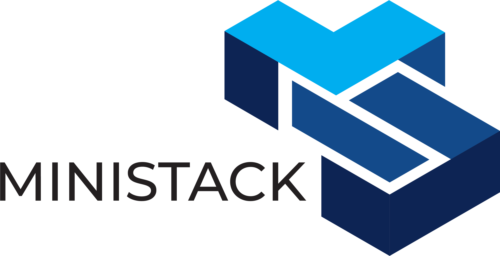

<p align="center">
  
</p>

<h1 align="center">Testcontainers MiniStack</h1>
<p align="center">Official <a href="https://www.testcontainers.org/">Testcontainers</a> module for <a href="https://ministack.org">MiniStack</a> — free, open-source AWS emulator.</p>

<p align="center">
  <a href="https://central.sonatype.com/artifact/org.ministack/testcontainers-ministack"></a>
  <a href="https://github.com/ministackorg/testcontainers-ministack/blob/main/LICENSE"></a>
  <a href="https://github.com/ministackorg/ministack"></a>
</p>

---

## Java

[](https://central.sonatype.com/artifact/org.ministack/testcontainers-ministack)

### Installation

**Maven**

```xml
<dependency>
  <groupId>org.ministack</groupId>
  <artifactId>testcontainers-ministack</artifactId>
  <version>0.1.5</version>
  <scope>test</scope>
</dependency>
```

**Gradle**

```groovy
testImplementation 'org.ministack:testcontainers-ministack:0.1.5'
```

### Quick start

```java
try(MiniStackContainer ministack = new MiniStackContainer()){
    ministack.start();
    String endpoint = ministack.getEndpoint();

    S3Client s3 = S3Client.builder()
            .endpointOverride(URI.create(endpoint))
            .region(ministack.getRegion())
            .credentialsProvider(StaticCredentialsProvider.create(
                    AwsBasicCredentials.create(ministack.getAccessKey(), ministack.getSecretKey())))
            .forcePathStyle(true)
            .build();

    s3.createBucket(b -> b.bucket("my-bucket"));
}
```

### Specific version

```java
// Pin to a specific MiniStack release
MiniStackContainer ministack = new MiniStackContainer("1.2.5");
```

### Configuration

```java
MiniStackContainer ministack = new MiniStackContainer("1.3.42")
    .withRegion("eu-west-1")                              // MINISTACK_REGION
    .withCredentials("AKIAEXAMPLE000000000", "secret")    // AWS_ACCESS_KEY_ID / AWS_SECRET_ACCESS_KEY
    .withPersistence()                                    // PERSIST_STATE=1 + S3_PERSIST=1
    .withImdsV2Required();                                // MINISTACK_IMDS_V2_REQUIRED=1
```

Pair `getMiniStackVersion()` with `Assumptions.assumeTrue(...)` to gate tests on capability:

```java
assumeTrue(ministack.getMiniStackVersion().compareTo("1.3.42") >= 0,
    "test requires MiniStack 1.3.42+");
```

Note: `getMiniStackVersion()` returns the image tag verbatim. Semver tags like `"1.3.42"` sort lexicographically as expected; `"latest"` and `"nightly"` won't. Pin a specific version tag when you need precise capability gating.

### Real Infrastructure

> **Security warning:** `withRealInfrastructure()` bind-mounts the host Docker socket into the MiniStack container. Anything running inside MiniStack — including arbitrary code in Lambda handlers or RDS init scripts — gains root-equivalent control of the host's container engine. Use only on trusted developer machines or isolated CI runners.

```java
try(MiniStackContainer ministack = new MiniStackContainer()){
    ministack.withRealInfrastructure();
    ministack.start();
    String endpoint = ministack.getEndpoint();

    RdsClient rds = RdsClient.builder().endpointOverride(endpoint()).region(region)
            .credentialsProvider(creds).build();

    rds.createDBInstance(b -> b
            .dbInstanceIdentifier("postgres")
            .dbInstanceClass("db.t3.micro")
            .engine("postgres")
            .masterUsername("admin")
            .masterUserPassword("password")
            .dbName("postgresdb")
            .allocatedStorage(20)
    );

    // MiniStack spawns a real Postgres container. Poll DescribeDBInstances
    // until it reports `available` before opening a JDBC connection.
    Awaitility.await()
        .atMost(Duration.ofMinutes(2))
        .pollInterval(Duration.ofSeconds(2))
        .until(() -> "available".equals(
            rds.describeDBInstances(b -> b.dbInstanceIdentifier("postgres"))
               .dbInstances().get(0).dbInstanceStatus()));
}
```

### What you get

- 55+ AWS services on a single container
- Health check waits for readiness automatically
- `getEndpoint()` returns the mapped URL for SDK configuration
- Works with any AWS SDK (Java, Go, Python, Node.js)
- Real database containers (RDS, ElastiCache) when Docker socket is mounted

## Other languages

Coming when requested. Open an issue or upvote [ministackorg/ministack](https://github.com/ministackorg/ministack/issues/250).

| Language | Status                         |
|----------|--------------------------------|
| Java     | **Published** on Maven Central |
| Go       | Planned                        |
| Python   | Planned                        |
| .NET     | Planned                        |

## License

MIT
